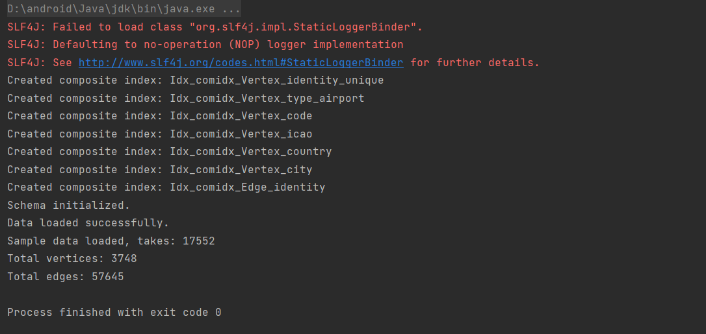
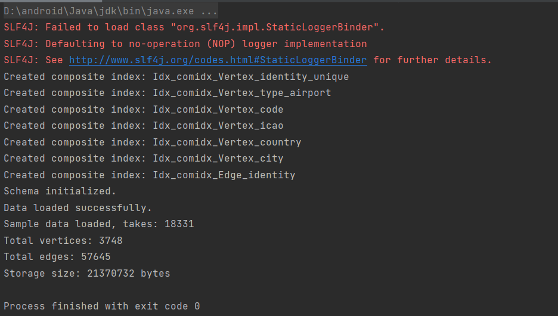
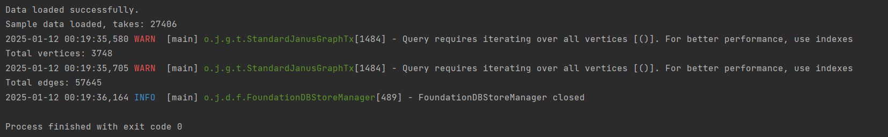
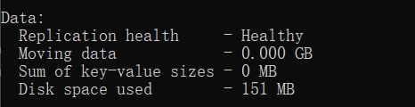
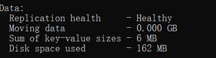
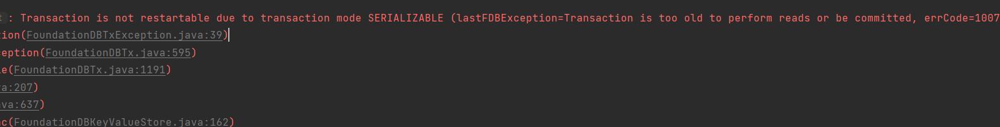

# Explore JanusGraph and its Storage Plugins

### Task 2: Inmemory Backend Performance

As we can see from the results, 3748 vertices and 57645 edges are loaded in 17552 milliseconds.
### Task 3: BerkeleyDB storage backend

As we can see from the results, 3748 vertices and 57645 edges are loaded in 18331 milliseconds. 
Takes 21370732 bytes which is about 20MB.
### Task 4: Foundationdb storage backend

As we can see from the results, 3748 vertices and 57645 edges are loaded in 27406 milliseconds. 
For storage, before adding the graph, the storage is:
### 
After adding the graph to fdb, the storage is:
### 
Pure key-value pairs takes about 6MB, total data is about 162-151=11MB.
#### Problems encountered while loading data:
Transaction problems happened when loading graph data:

This is due to the transactions in FDB have a hard timeout limit (5 seconds by default), which can be a challenge for tasks that require large amounts of data to be loaded.
I solve this problem by optimizing the loading function and make it able to load edges in batches.
### Task 5: Thoughts about the different performance between BerkeleyDB and Foundationdb.
The simple application is single-node, and BerkeleyDB aiming for high-performance access on a single machine. 
While for foundationDB, it provides ACID transaction support can have a performance impact on single nodes while better performance in distributed scenarios. 
So, this may be the cause of the different performance between BerkeleyDB and Foundationdb.